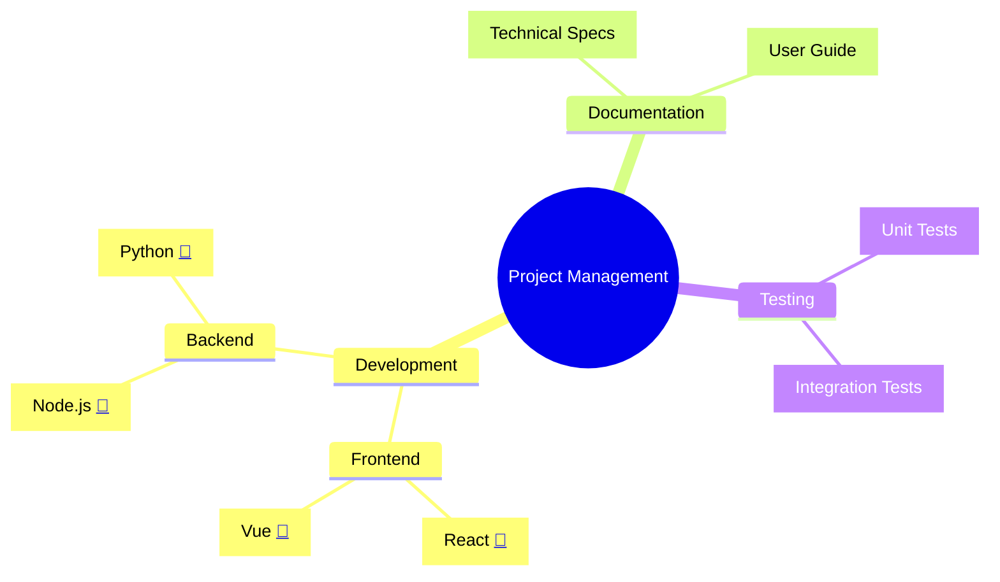

```mermaid
mindmap
    root((Project Management))
        Development
            Frontend
                React[React <a href='https://reactjs.org'>🔗</a>]
                Vue[Vue <a href='https://vuejs.org'>🔗</a>]
            Backend
                NodeJS[Node.js <a href='https://nodejs.org'>🔗</a>]
                Python[Python <a href='https://python.org'>🔗</a>]
        Documentation
            Tech[Technical Specs]
            Guide[User Guide]
        Testing
            Unit[Unit Tests]
            Integration[Integration Tests]
```
