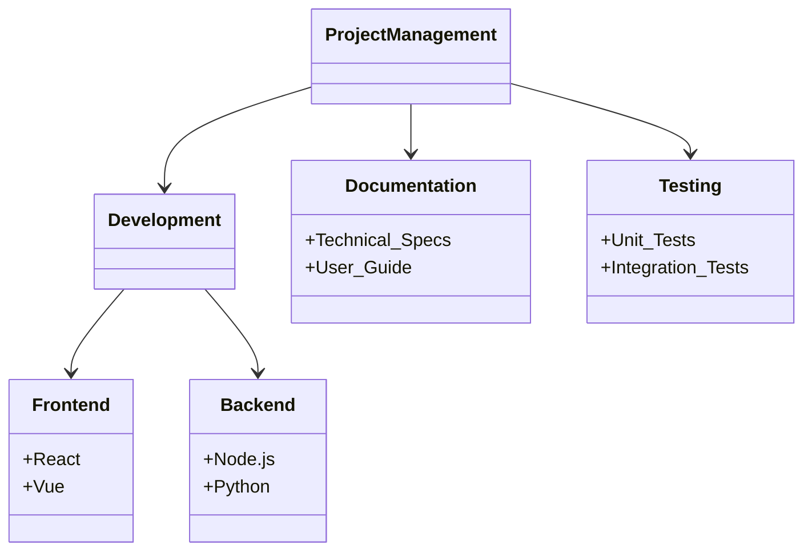

```mermaid
classDiagram
    ProjectManagement --> Development
    ProjectManagement --> Documentation
    ProjectManagement --> Testing
    
    Development --> Frontend
    Development --> Backend
    
    class Frontend {
        +React
        +Vue
    }
    click Frontend href "https://example.com/frontend"
    
    class Backend {
        +Node.js
        +Python
    }
    click Backend href "https://example.com/backend"
    
    class Documentation {
        +Technical_Specs
        +User_Guide
    }
    
    class Testing {
        +Unit_Tests
        +Integration_Tests
    }
```
