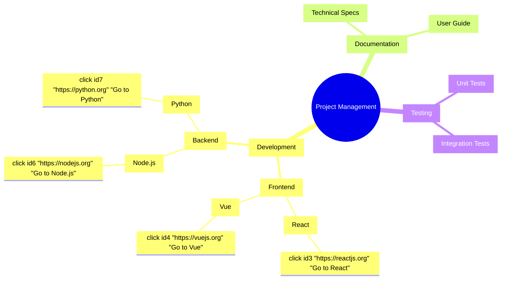

```mermaid
mindmap
  root((Project Management))
    id1[Development]
      id2[Frontend]
        id3[React]
          click id3 "https://reactjs.org" "Go to React"
        id4[Vue]
          click id4 "https://vuejs.org" "Go to Vue"
      id5[Backend]
        id6[Node.js]
          click id6 "https://nodejs.org" "Go to Node.js"
        id7[Python]
          click id7 "https://python.org" "Go to Python"
    id8[Documentation]
      id9[Technical Specs]
      id10[User Guide]
    id11[Testing]
      id12[Unit Tests]
      id13[Integration Tests]
```
